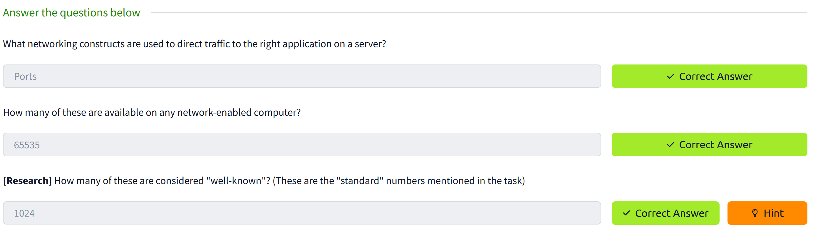

# Rendu sur le TD1 Nmap

## 2. Introduction

  

## 3. Nmap switchs

  

  

## 5. TCP Connect scans

  

## 6. SYN scans

  

## 7. UDP scans

  

## 8. NULL, FIN and XMAS scans

  

## 9. ICMP Network Scanning

  

## 10. NSE scripts Overview

  

## 11. Working with NSE scripts

  

## 12. Searching for NSE scripts

  

  

  

## 13. Firewall Evasion

  

  

## 14. Practical

  

  

  

  

  

- La machine ne répond pas au ping.
- avec une attaque XMAS, sur les 999 on a aucune réponse.
- avec une attaque SYN, on a 5 ports ouverts.
- nmap peut se connecter au ftp en mode anonyme.