# Rendu sur le TD2 Burp

## 2. What's a Repeater ?

  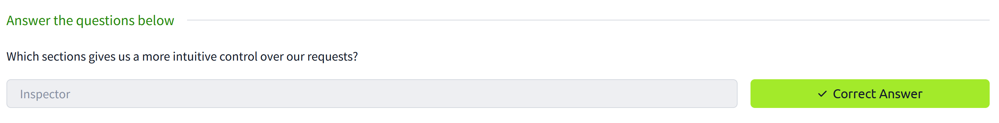

## 3. Basic Usage

  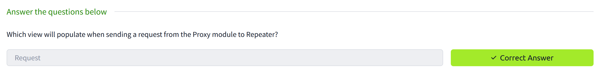

## 4. Message Analysis Toolbar

  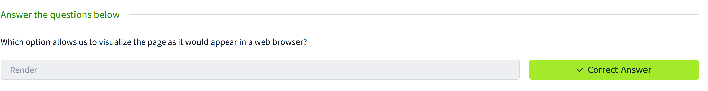

## 5. Inspector

  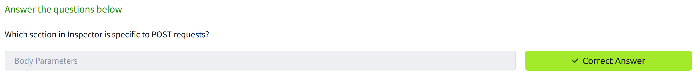

## 6. Practical Exemple

  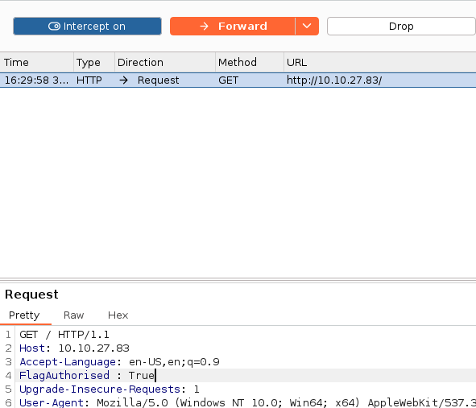

  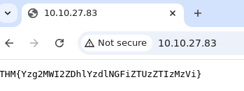

  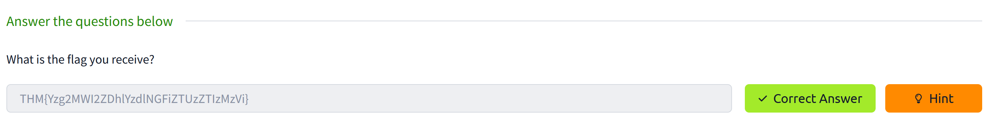

En utilisant le proxy, on peut intercepter les requêtes et les modifier avant de les envoyer au serveur. Ici on a ajouté "FlagAuthorised: true" dans le header de la requête. Ce qui a permis d'accéder au flag.

## 7. Challenge

  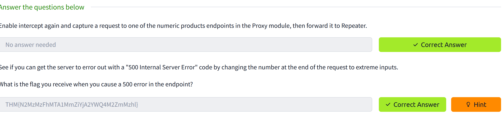

  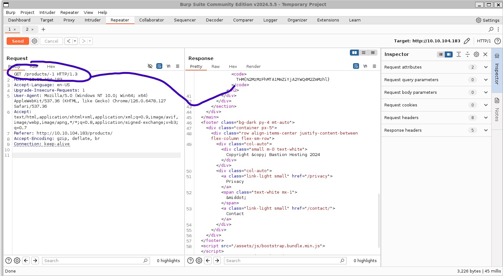

## 8. Extra-mile Challenge

  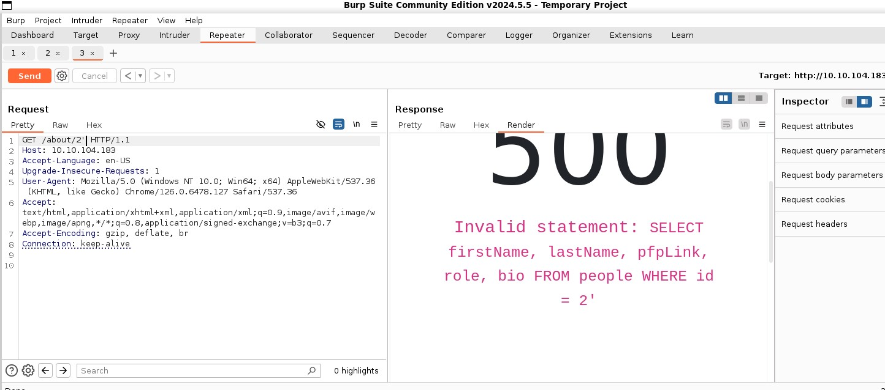

  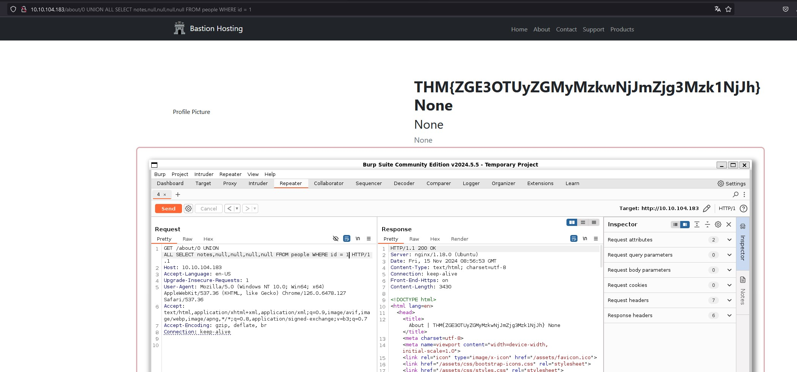

On a pu profiter d'un bug dans le système de pagination pour envoyer des injections SQL.

