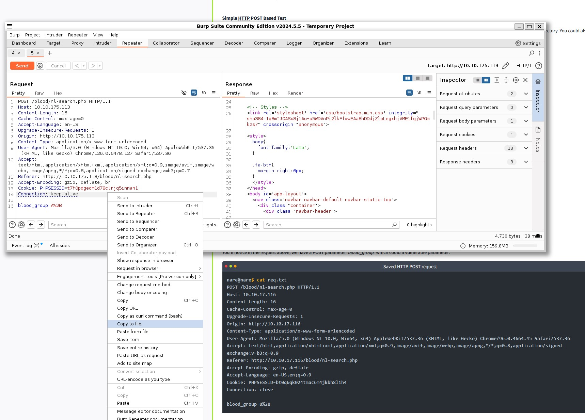

# Rendu sur le TD3 SQLMAP

## 2. Using SQLMAP

  

## 3. SQLMAP challenge

J'ai pas utiliser gobuster pour trouver les pages, parce que j'avais pas vu l'indice, j'ai simplement suivie l'exemple.

  

On a un formulaire dans lequel on peut mettre un type de sang, et c'est ce formulaire qui est vulnérable à une injection SQL.

  

On peut récupérer la requête dans burp pour la donner à sqlmap.

  

à partir de là, SQLMAP fonctionne et on peut récupérer les données de la base de données.

  

  

  

  

  

