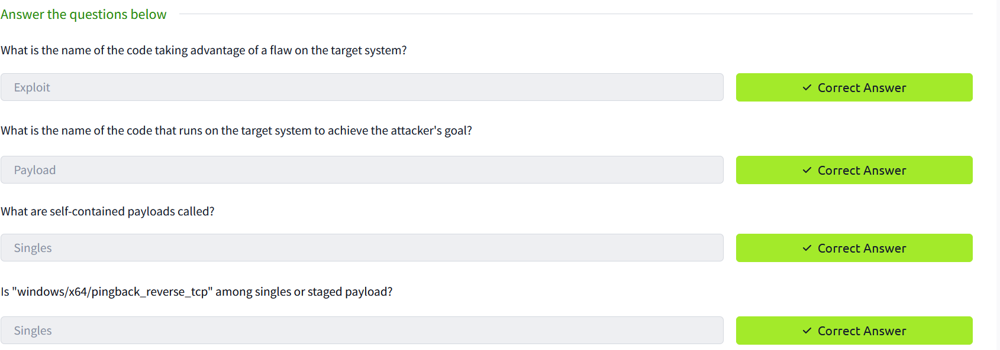
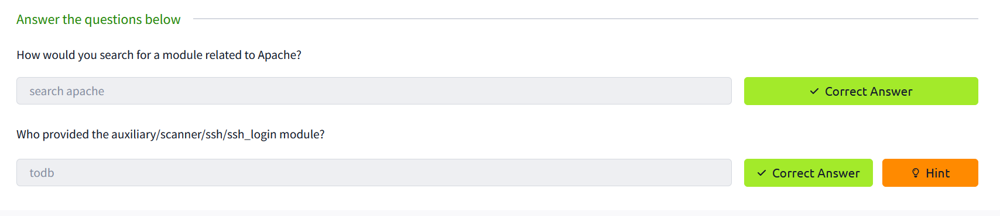
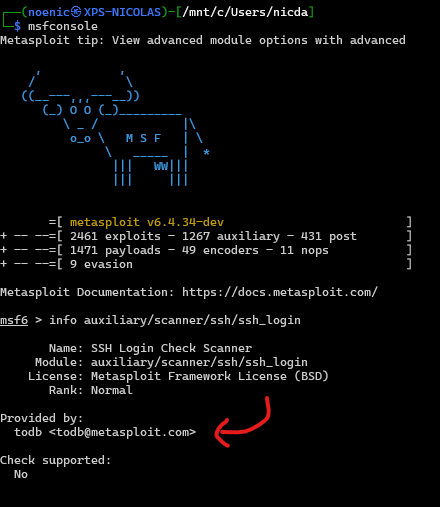
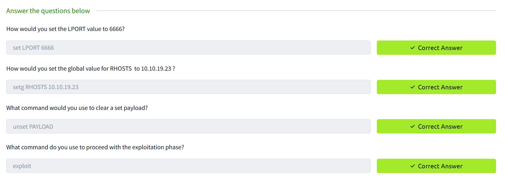
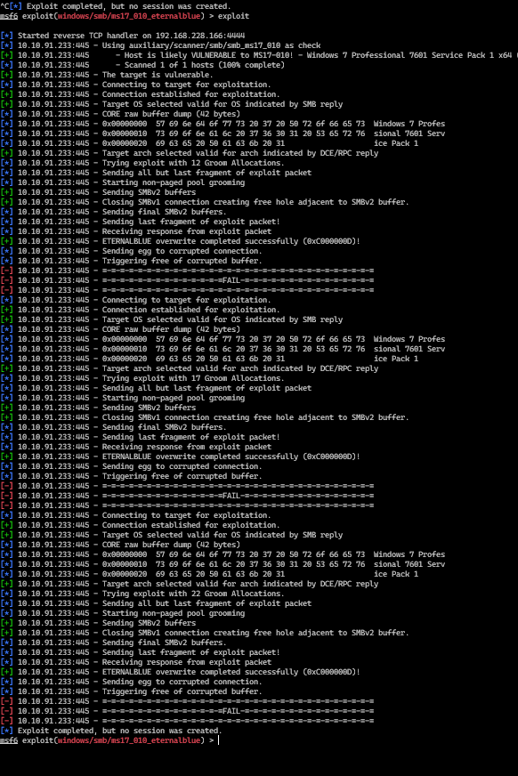

# Rendu sur le TD4 Metasploit

## 2. Main component of Metasploit

  

## 3. msfconsole

  

  

## 4. Working with modules

  

  

En essayant de lancer l'exploit, je n'ai pas réussi à obtenir un shell (peu importe la veleur de `Groom Allocations`.). j'ai mis en commun avec d'autres étudiants et eux non plus n'ont pas réussi à obtenir un shell. Pour le moment, je n'ai pas de solution à ce problème.