# Rendu sur la machine VulnCMS

## Introduction

Ce document retrace l'exploitation de la machine **VulnCMS**. Cette machine virtuelle, construite autour de CMS populaires, propose divers services web que nous avons analysés pour identifier des failles exploitables. Chaque étape est expliquée avec précision pour maintenir le fil logique de la démarche.

---

## Étape 1 : Reconnaissance

### 1.1 Découverte de la machine

La première étape a consisté à identifier l’adresse IP de la machine cible. Un scan réseau a révélé l’IP **192.168.228.167**.

    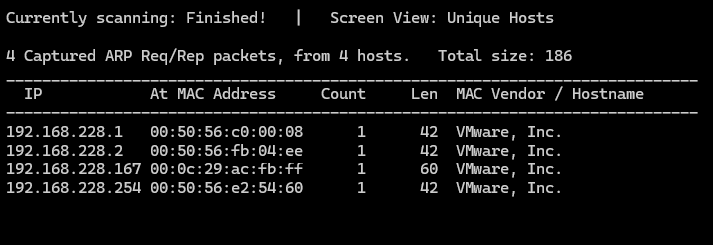

### 1.2 Scan des ports ouverts

Un scan Nmap a mis en évidence plusieurs ports ouverts, associés à des services web basés sur des CMS bien connus :

- **Nginx** sur le port **80**
- **WordPress** sur le port **5000**
- **Joomla** sur le port **8001**
- **Drupal** sur le port **9001**

    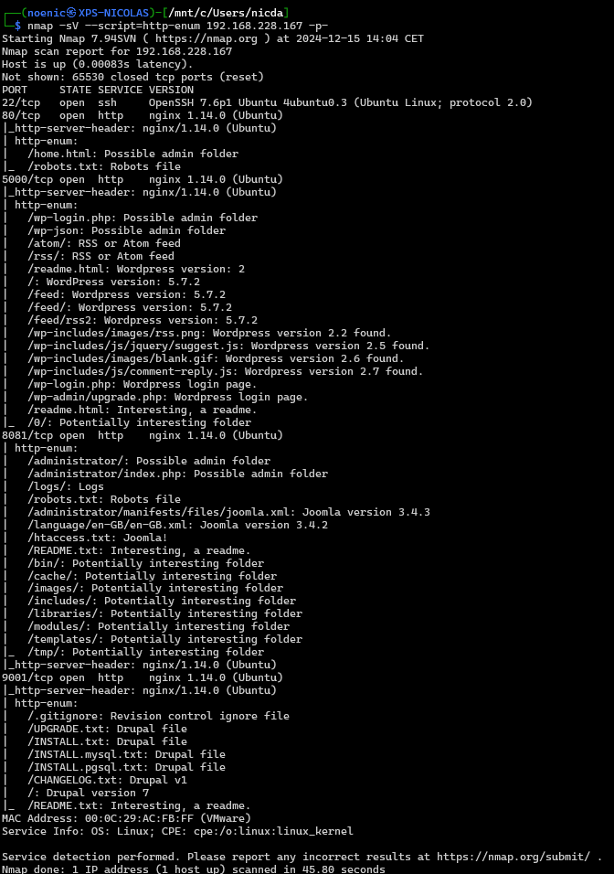

---

## Étape 2 : Attaque

### 2.1 Nginx
---

En accédant au site web sur le port 80, la page d’accueil standard de Nginx apparaît. Une exploration des fichiers accessibles a révélé plusieurs pages intéressantes.

Déjà on comprend que le site est basé sur la série `Mr. Robot` avec des références à `fsociety`, `Elliot` et `Mobley`.

    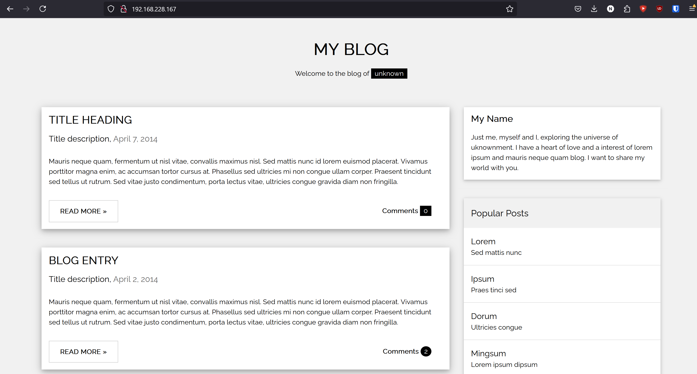

    

Le fichier `/robots.txt` mentionne une page cachée, `/about.html`, mais celle-ci ne contient aucune information exploitable.

    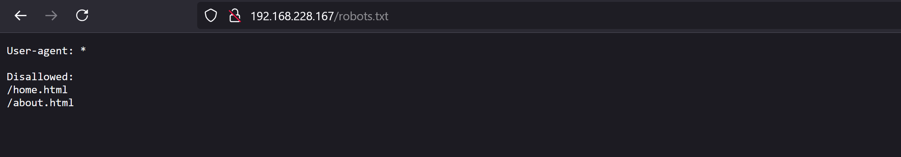

    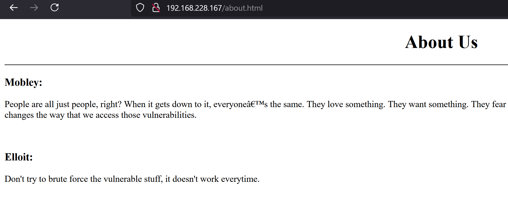

On ne retrouve pas d'informations vraiment intéressantes sur ce site, mis à part les références à la série `Mr. Robot`.

Des recherches sur la version `1.14.0` de Nginx n’ont pas permis d’identifier d’exploit applicable. Les investigations se sont donc orientées vers d’autres services.

    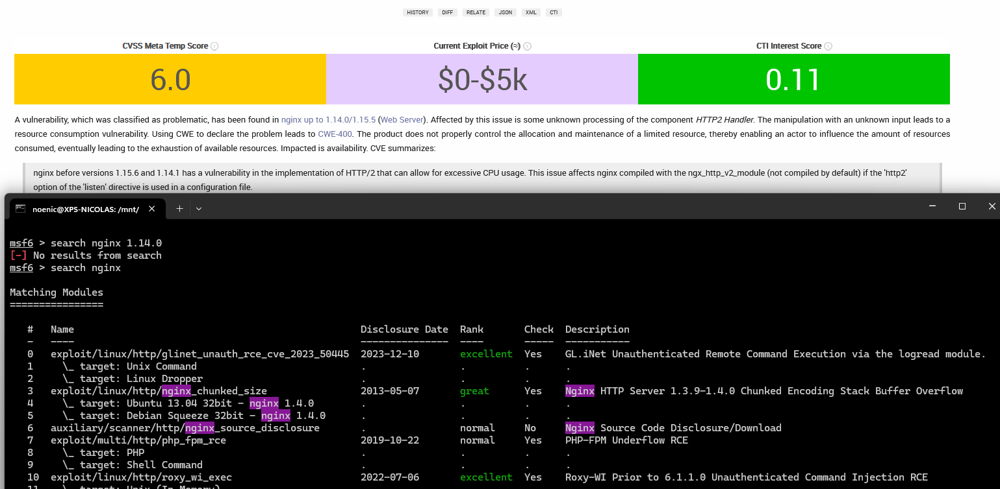

   

### 2.2 WordPress
---

Le site WordPress, accessible sur le port **5000**, présentait initialement un problème d’affichage : les fichiers CSS ne se chargeaient pas. Une inspection du code source a révélé que le domaine `fsociety.web` devait être ajouté au fichier `/etc/hosts`.

**Avant :**

    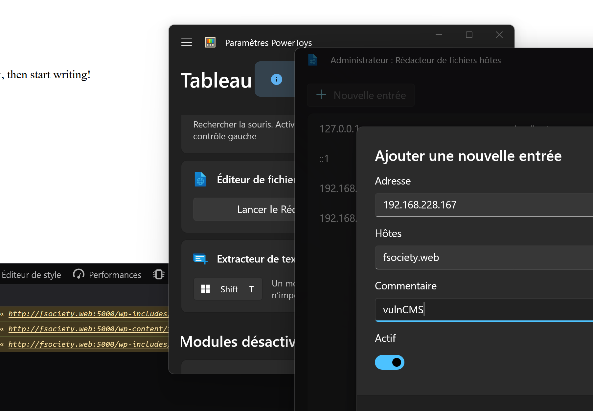

**Après modification :**

    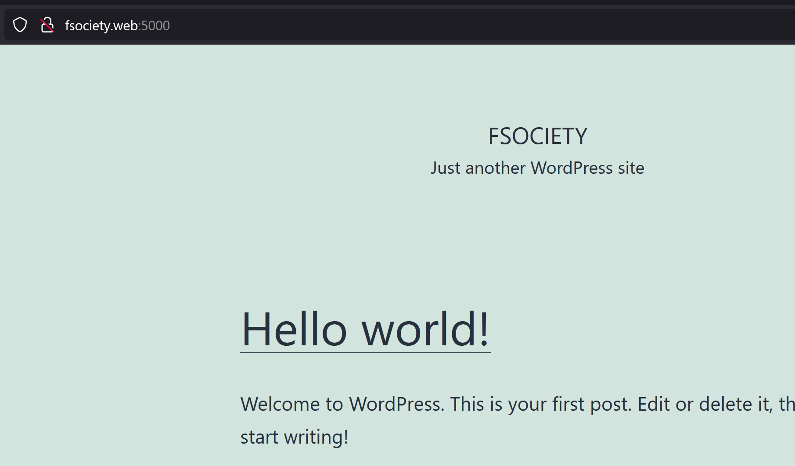

Machinalement, quand on a un service WordPress, on tente une attaque par force brute sur `/admin`. C'est ce que j'ai fait avec Metasploit.

    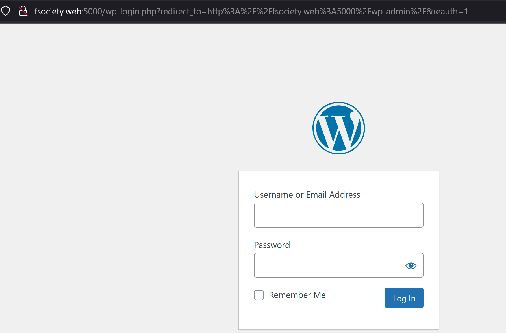

    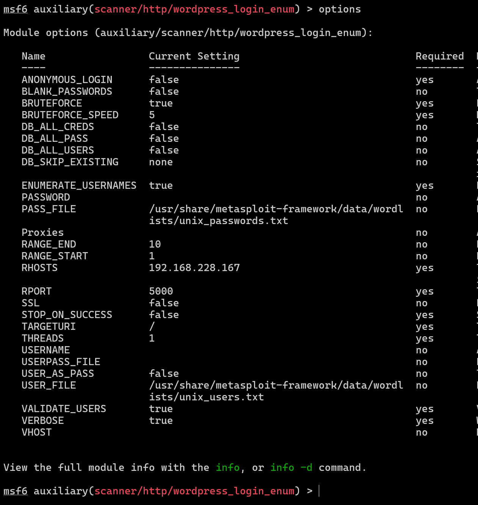

    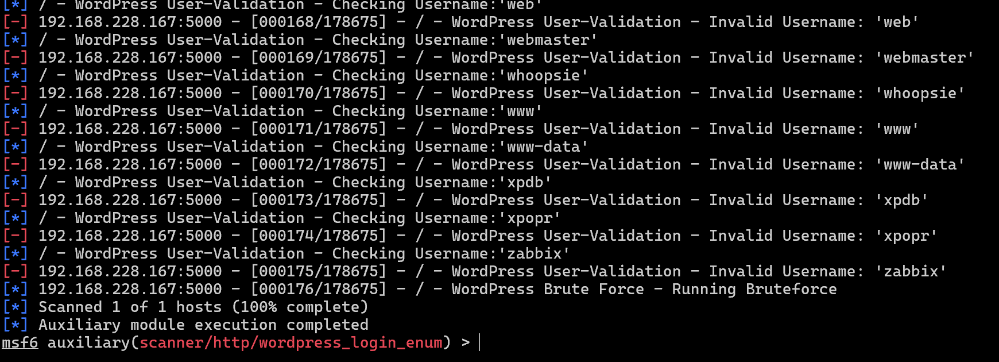

L’attaque par force brute a échoué.

Cependant, une faute de frappe inattendue a révélé un webshell caché à l’adresse `/amdin`.

    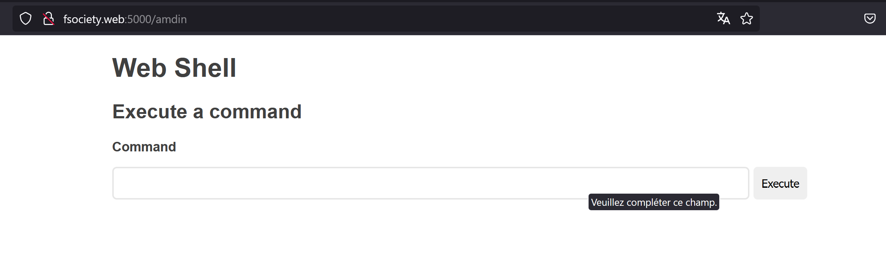

    

Ce webshell, bien que fonctionnel, n'est pas très pratique : il y a des problèmes avec l’échappement des caractères, et les commandes ne sont pas très lisibles. J'ai donc décidé de lancer un reverse shell en utilisant un script bash.

    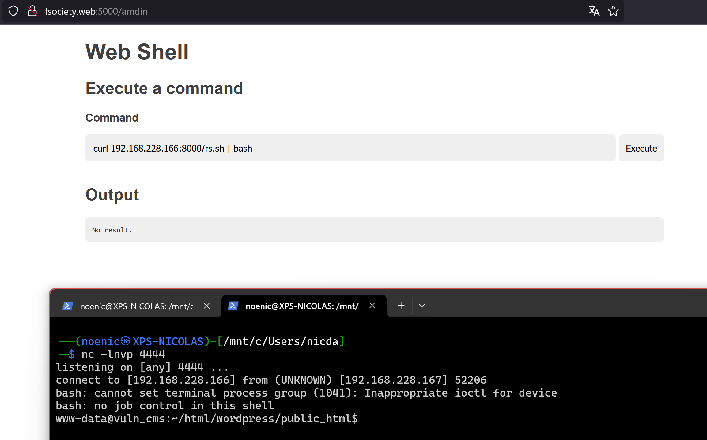

J'ai ensuite pu lancer un LinPEAS (un script d'audit de sécurité) pour analyser la machine et trouver des failles potentielles. Il m'a trouvé pas mal d'informations intéressantes, notamment un fichier contenant un mot de passe pour l'utilisateur `tyrell`.

    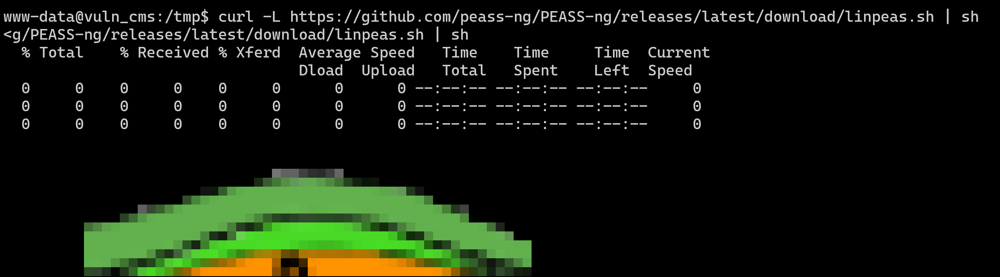

    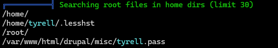

    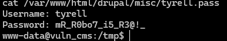

    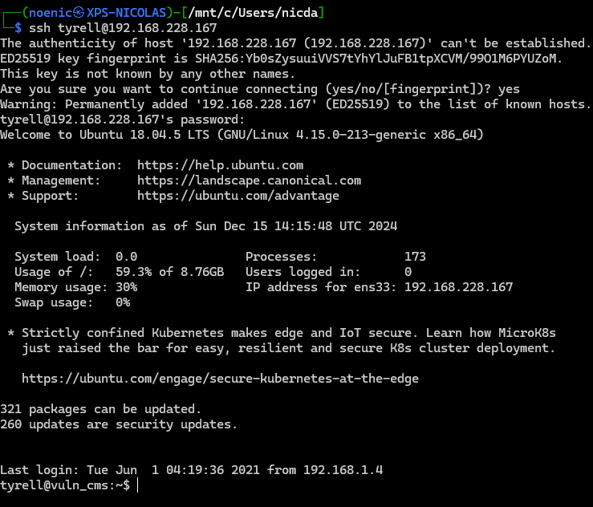

Dès qu'on a un accès utilisateur, on cherche à obtenir un accès root. Pour cela, on peut utiliser `sudo -l` pour voir les commandes que l'on peut exécuter avec les droits `sudo`. On peut voir que l'on peut exécuter `journalctl` sans mot de passe. Il nous suffit donc de suivre les instructions de [GTFOBins](https://gtfobins.github.io/gtfobins/journalctl/) pour obtenir un accès root.

    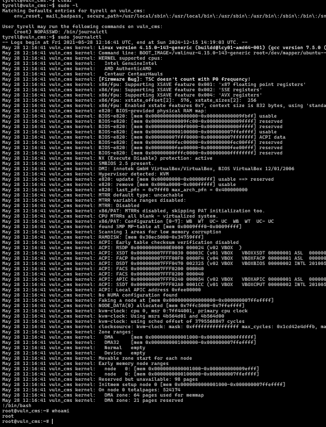

---
   

### 2.3 Joomla
---

Le site Joomla, accessible sur le port **8001**, utilisait la version `3.4.3`. 

Un scan avec `joomscan` a confirmé une vulnérabilité à une injection SQL.

    

Grâce aux informations obtenues, on a pu faire plus de recherches sur cette faille.

    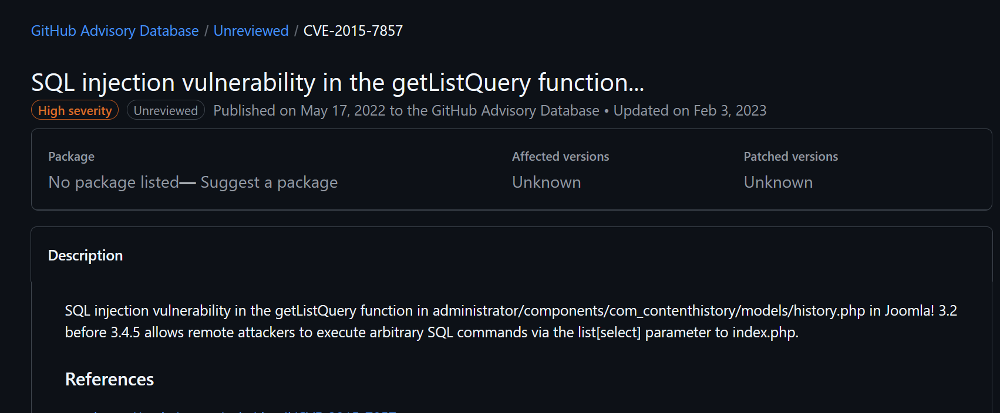

L’attaque a été menée avec `sqlmap` pour exploiter cette faille.

    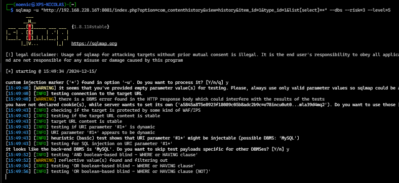

    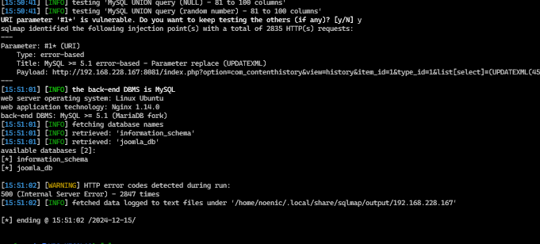

    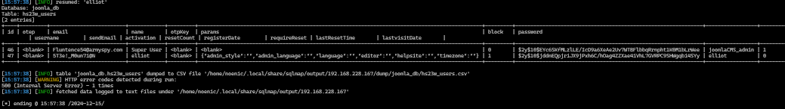

Dans ce dump, on a pu trouver des informations sur l'utilisateur `elliot`. Déjà, on a son mot de passe hashé, mais on a aussi son adresse mail, vu que celle-ci ne ressemble pas à une adresse mail classique je me suis dit que c'était un indice. Après déchiffrage, j'ai reconnu que `5te!_M0un71@N` était `Steel Mountain`, un lieu important dans la série `Mr. Robot`. C'était trop évident pour être ignoré.
J'ai donc essayé ce mot de passe pour me connecter en tant qu'elliot.

    

Une fois connecté, les mêmes techniques que pour WordPress ont été appliquées pour obtenir un accès root.

---

   

### 2.4 Drupal
---

Drupal, sur le port **9001**, a été exploité avec l’exploit `drupal_drupalgeddon2` disponible dans Metasploit.

    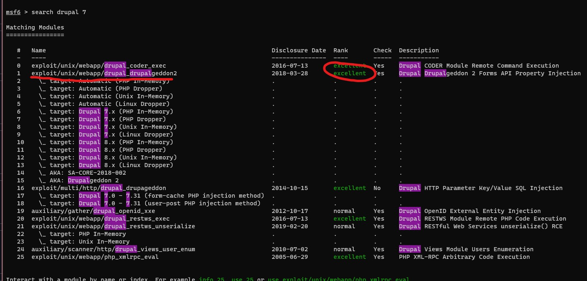

    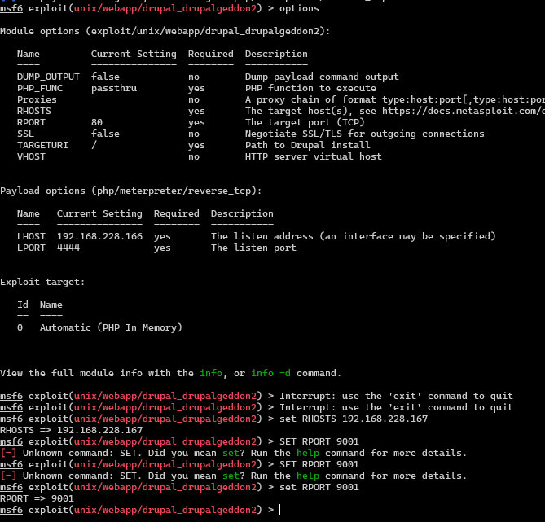

    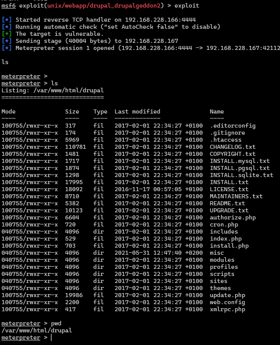

Même technique que pour les autres CMS pour obtenir un accès root.

---

## Conclusion

En conclusion, l'exploitation de la machine **VulnCMS** a permis de mettre en évidence plusieurs failles de sécurité dans des services web basés sur des CMS populaires :

- **Nginx** : aucune faille exploitée (fausse piste avec des références à `Mr. Robot`).
- **WordPress** : exploitation d’un webshell et élévation de privilèges.
- **Joomla** : exploitation d’une injection SQL.
- **Drupal** : exploitation de la faille `Drupalgeddon2`.

Ces attaques ont permis d’obtenir des accès utilisateurs, puis des accès root, en exploitant des failles bien connues. L'exploit le plus intéressant a été celui de Joomla, qui a nécessité des recherches et une exploitation manuelle.
