# Rendu sur la machine pentest lab SQLinject to shell

## Introduction

Ce document retrace l'exploitation de la machine SQLinject to shell du pentest lab.

---

## Étape 1 : Reconnaissance

### 1.1 Découverte de la machine

Comme d'habitude, nous commençons par scanner le réseau pour découvrir les machines.

  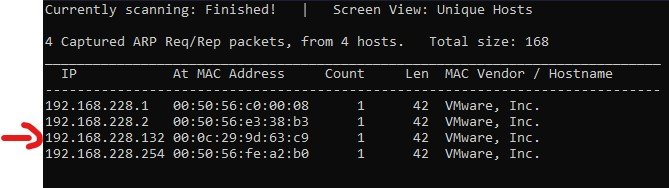

La machine a pour adresse IP `192.168.228.132`.

### 1.2 Scan des ports ouverts

On va maintenant scanner les ports ouverts sur la machine.
En utilisant Nmap avec l'options `-sV` pour déterminer les versions des services.

  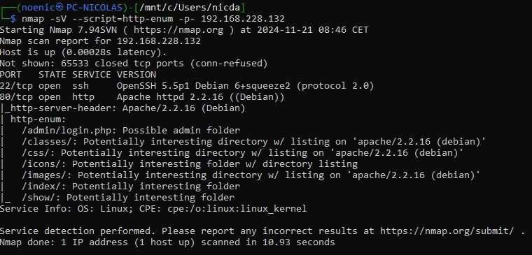

On remarque plusieurs services : 

- Un service `SSH` sur le port 22 (OpenSSH 5.5p1)
- Un service `HTTP` sur le port 80 (Apache httpd 2.2.16)

## Étape 2 : Attaque

### 2.1 Apache

On commence par visiter la page web de la machine.

  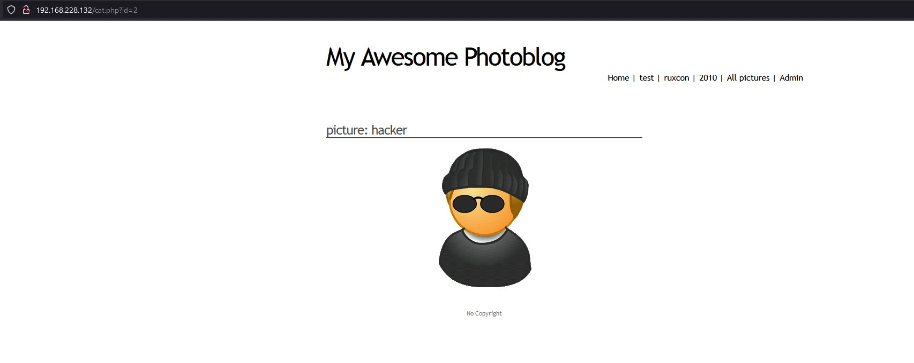

On se retrouve sur des pages web présentant du contenu. On peut voir dans l'url qu'on à des paramètres, Si on clique sur une image on voit dans l'url `?id=*` on peut donc penser à une injection SQL (c'est le thème de la machine).

On a aussi une page admin qui nous demande des identifiants.

  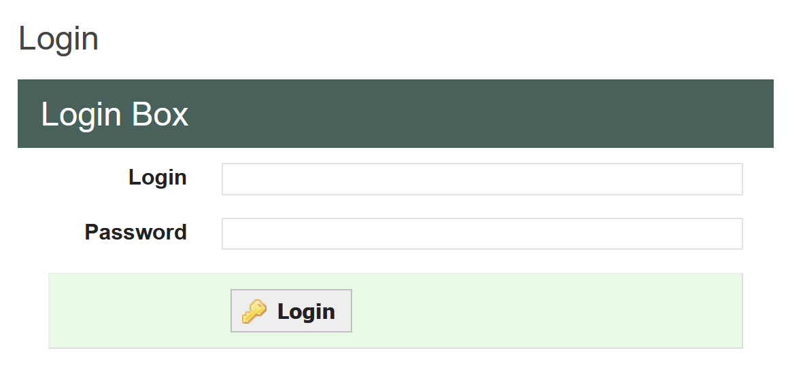

Mais ayant fait le TD sur sqlmap juste avant, j'ai directement essayé de lancer une injection SQL sur le paramètre `id` de l'url.

  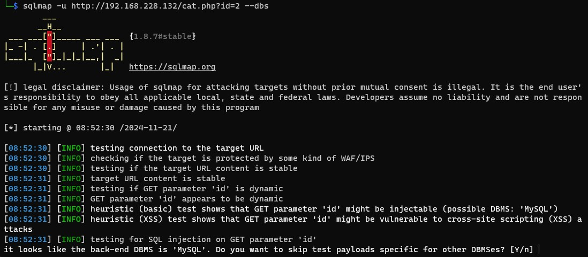

  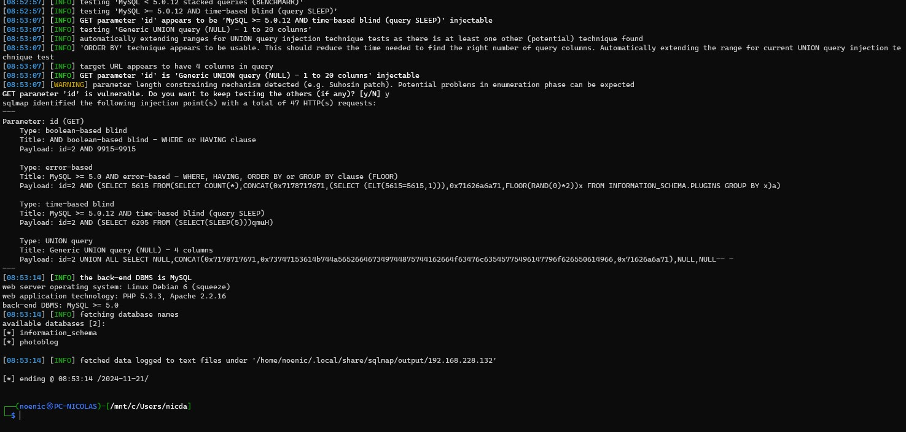

Avec sqlmap on a pu récupérer les bases de données disponibles : 
- `photoblog` : Base de données du site
- `information_schema` : Base de données système

On va maintenant essayer de récupérer les tables de la base de données `photoblog`.

  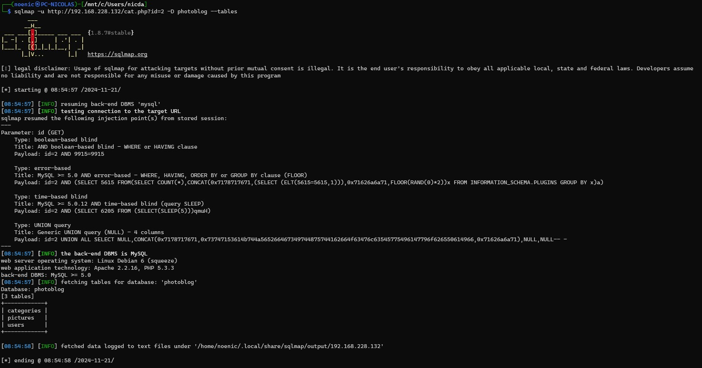

On sait maintenant qu'on va avoir des données intéressantes dans la base de données, on va donc essayer de la dump.

  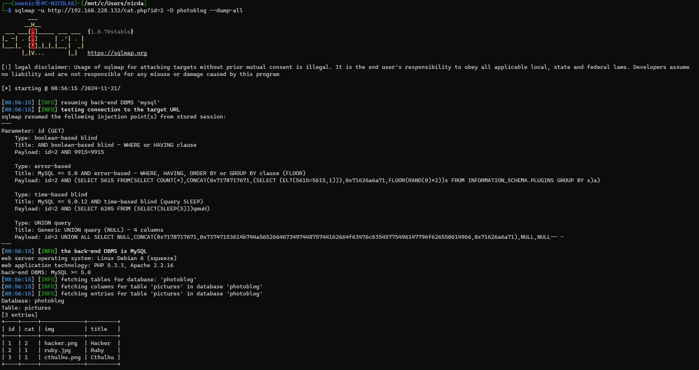

  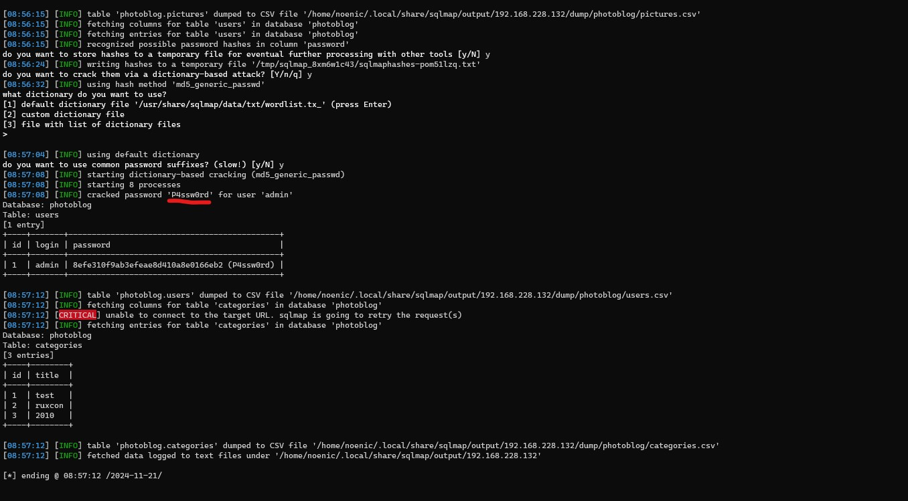 

Sqlmap à réussi à dump toutes les tables de la base de données `photoblog`. Il a même réussi à récupérer le mot de passe de l'utilisateur `admin` : `P4ssw0rd`.

On va maintenant pouvoir se connecter à la page admin, qui nous permettra d'ajouter du contenu sur le site.

  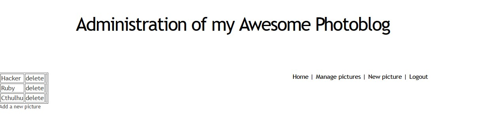

Comme tout bon pentester, on va essayer d'injecter du code PHP pour obtenir un shell.

mais d'abbord je voulais tester si on pouvait pas directement utiliser sqlmap pour obtenir un shell.

  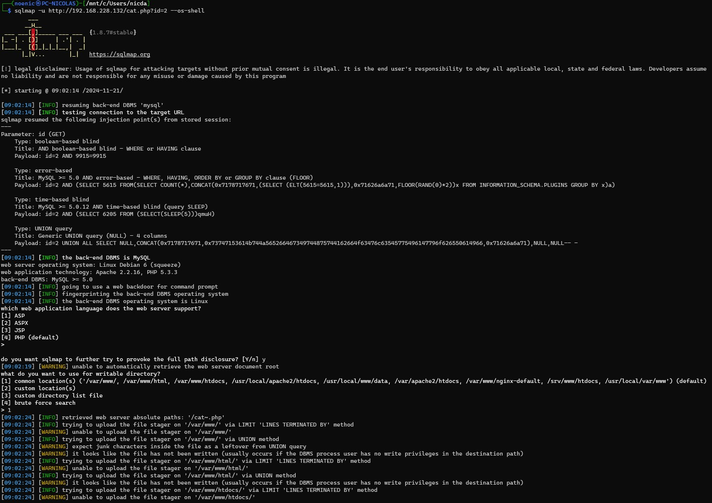

  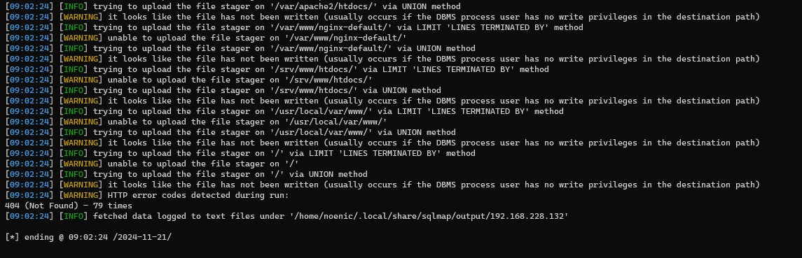

C'est un échec, on va revenir à notre idée de base, injecter du code PHP.

  

On ne peut pas uploader de fichier PHP, Il va falloir comprendre comment le site fait pour detecter les fichiers PHP.

Au début j'ai sorti mon burp suite, pour voir si je pouvais pas intercepter la requête et la modifier pour bypass le filtre.

  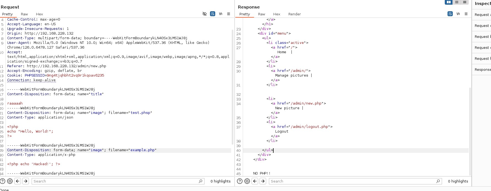

Mais j'ai vite compris que le site devait vérifier l'extension du fichier, j'ai donc essayé de renommer un fichier PHP en `.php5` pour voir si ça passait (car apache peut executer des fichiers `.php5`).

  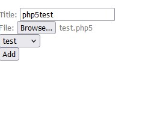

On arrive à uploader le fichier, mais il n'est pas executé, apparemment apache n'est pas configuré pour executer les fichiers `.php5`.

J'ai essayé avec d'autres extensions (phtml,inc, php3, php4,cgi, png, jpg, gif, etc...) mais rien n'a fonctionné.

Tentative avec l'extension `.cgi`

  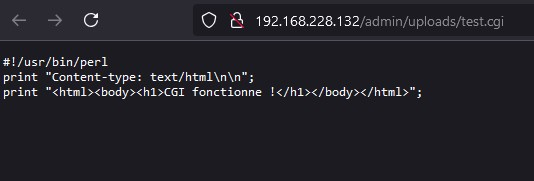

Tentative avec l'extension `.inc`

  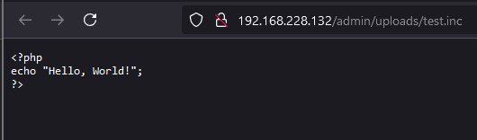

Tentative avec l'extension `.php5`

  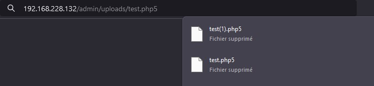

Tentative avec l'extension `.html`

  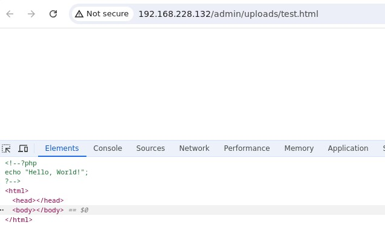

On s'est dit que si le serveur retournait "NO PHP" c'est qu'il devait vérifier que l'extension du fichier soit `.php`. Avec un peu de chance, il ne vérifie qu'en minuscule et que je pourrais donc bypass le filtre en renommant mon fichier en `.PHP`.

  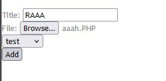

  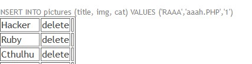

En mettant le fichier en majuscule, on arrive à bypass le filtre et à executer notre code PHP.

A partir de là, on a un shell sur la machine quand on va sur le fichier dans `uploads/`. ou quand le serveur essaye d'afficher le contenu du fichier sur la page par default.

  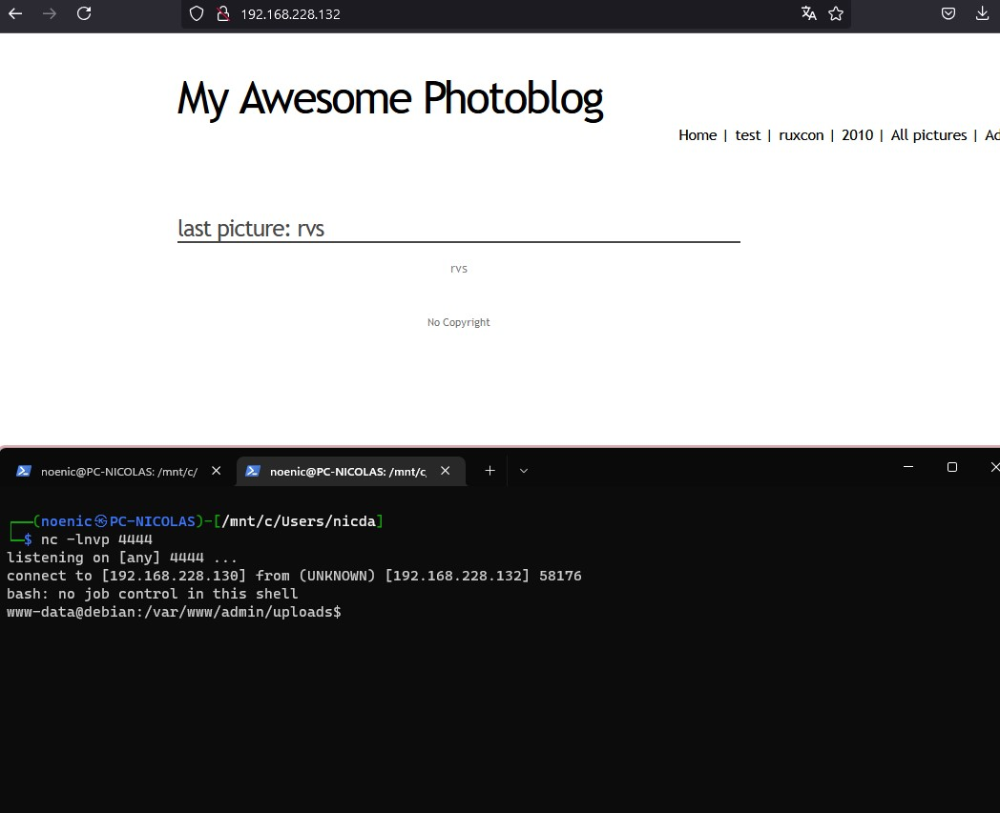

A partir de là, comme d'habitude, on va utiliser `linpeas.sh` pour voir si on peut trouver des informations intéressantes.

Pour une raison de SSL, je n'ai pas pu le télécharger directement sur la machine, j'ai donc du le télécharger sur ma machine et le transférer sur la machine cible.

  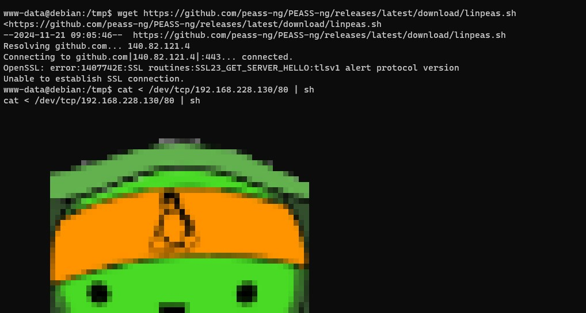

Mais après avoir regardé les consignes et mis en commun avec les autres, on a vu qu'il n'était pas nécessaire de chercher root et qu'un simple shell était suffisant.
On a donc arrêté là.

Mais vu l'age de la machine ça m'étonnerait pas qu'on puisse exploiter une faille dans l'OS pour obtenir un shell root. (Possiblement dirtycow car la machine est en 2.6.32)

## Conclusion

C'était une machine plutôt simple en ce qui concerne l'exploitation, mais je ne l'ai pas trouvé très intéressante, c'était surtout du `die and retry` pour bypass le filtre. Il y a peu-être une autre méthode mais je n'ai pas trouvé.
