# Rendu sur la machine FunBOX

## Introduction

Ce document retrace l'exploitation de la machine **FunBOX** dans le cadre du cours de hacking éthique.

---

## Étape 1 : Reconnaissance

### 1.1 Découverte de la machine


La cible a été identifiée à l'adresse IP `192.168.228.133`

### 1.2 Scan des ports ouverts
<p align="center">
  
</p>

Le scan Nmap a révélé plusieurs ports ouverts, dont :
- **SSH** sur le port **22** (OpenSSH 7.2p2)
- **HTTP** sur le port **80** (Apache httpd 2.4.18)
- **pop3** sur le port **110** (Dovecot pop3d)
- **imap** sur le port **143** (Dovecot imapd)

⚠️ Nous avons eu comme consigne de ne pas se focaliser sur les services `pop3` et `imap` par souci de temps. J'ai fait des recherches sur ces services pour comprendre leur fonctionnement et leurs vulnérabilités, mais je n'y ai pas consacré assez de temps pour vraiment les exploiter. Ces services ne seront donc pas abordés dans ce document.

---

## Étape 2 : Attaque

### 2.1 Apache

En accédant au site web sur le port 80, on découvre qu'il n'y a pas de page d'accueil. On le remarque aussi à cause du retour du script `http-enum` de Nmap.

<p align="center">
  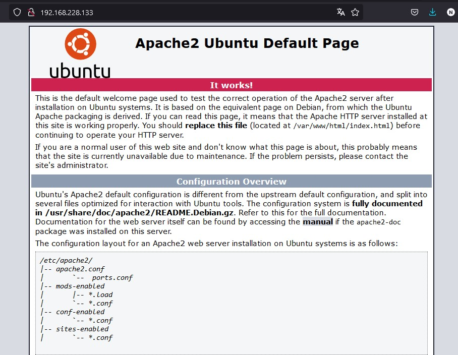
</p>

Cela signifie que le site est vide. J'ai passé un peu de temps à tourner en rond. C'est donc à ce moment-là que j'ai décidé de me concentrer sur le service SSH (cf 2.2) et de revenir sur le service HTTP plus tard.

En retournant sur vulnHUB pour relire la description de la machine, j'ai vu que le créateur de la machine avait laissé deux indices.

<p align="center">
  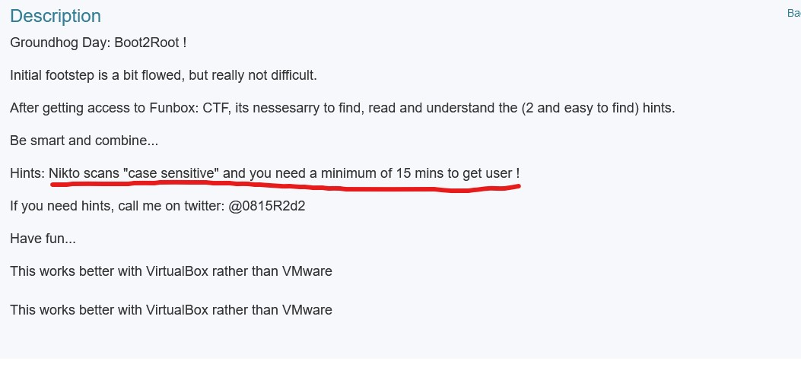
</p>

Finalement, j'ai compris que :

- `nikto` était un outil de scan de vulnérabilités web (visiblement sensible à la casse).
- Le user est accessible au bout de 15 minutes, ce qui était probablement un indice sur un bruteforce.

J'ai donc d'abord essayé l'outil `nikto` en le lançant sur l'adresse IP de la machine. 
<p align="center">
  
</p>

Évidemment, l'outil n'a rien trouvé. Mais en raisonnant avec des amis, on a compris que des chemins du serveur web pouvaient être en majuscule et que `nikto` ne les trouverait pas. On est donc partis sur un bruteforce de répertoires avec `dirb`, qui lui pourrait trouver des répertoires en majuscules et en minuscules.

<p align="center">
  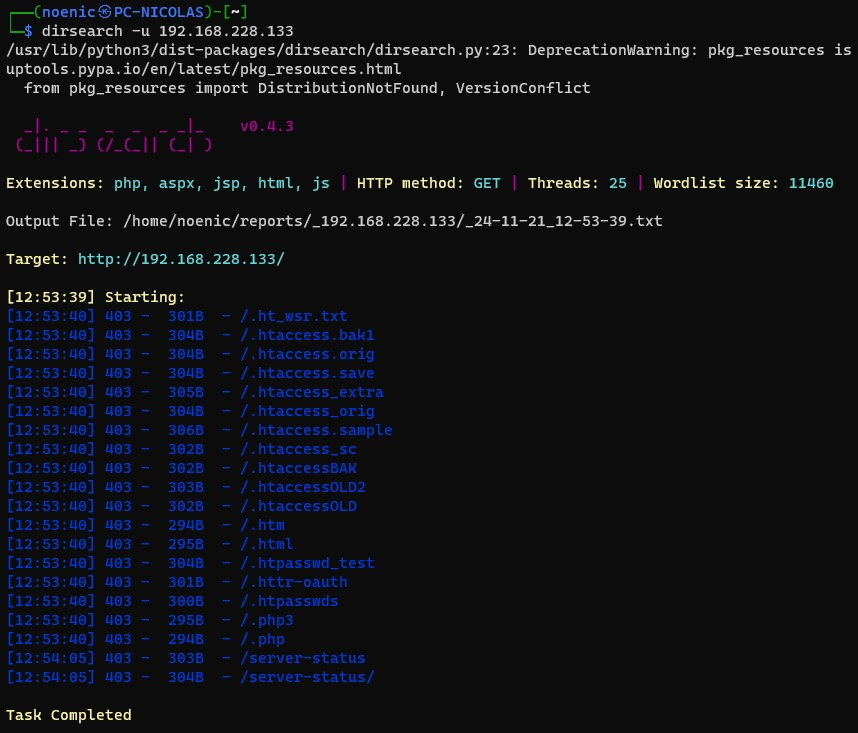
</p>

dirb, par défaut, ne fait pas la recherche de répertoires en majuscules. J'ai donc relancé la recherche avec l'option `-U` pour inclure les répertoires en majuscules.

<p align="center">
  
</p>

Et là, bingo, on trouve un `ROBOTS.TXT`

<p align="center">
  
</p>

On tombe sur `upload/` mais cette page est forbidden. 

En regardant le code source de la page, on voit qu'il y a un autre répertoire caché tout en bas de la page.

<p align="center">
  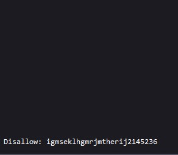
</p>

On se rend donc sur ce répertoire pour se retrouver encore sur un forbidden. 

<p align="center">
  
</p>

On va donc essayer de bruteforcer les répertoires de ce répertoire avec `dirb` pour voir si on trouve quelque chose.

En minuscule :
<p align="center">
  
</p>

En majuscule :
<p align="center">
  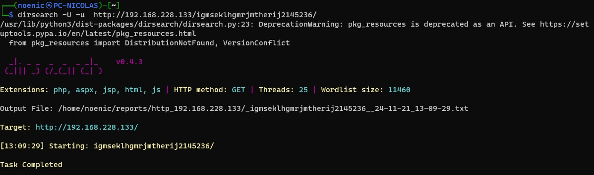
</p>

On a donc trouvé un répertoire `upload` qui est accessible. On va donc essayer de voir ce qu'on y trouve.

<p align="center">
  
</p>

On va y uploader un fichier php pour voir si on peut avoir accès à l'exécution de code et donc à un shell.

<p align="center">
  
</p>

On obtient bien un shell quand on va sur le fichier uploadé.

<p align="center">
  
</p>

Grâce à l'attaque sur le service SSH (pardon pour le spoil), on sait qu'il y a un utilisateur `thomas` sur la machine. J'ai donc dans un premier temps cherché à voir si je pouvais trouver des informations sur cet utilisateur dans le répertoire `/home/thomas`.

J'y ai retrouvé un fichier `.todo` qui contient des informations.

<p align="center">
  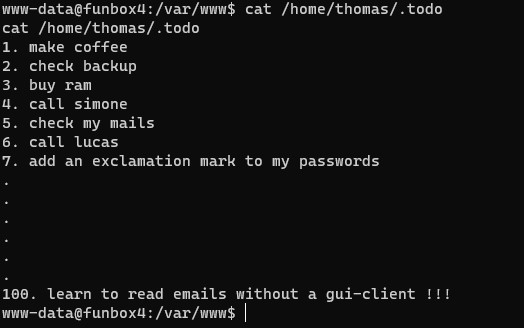
</p>

En cherchant un peu plus, j'ai trouvé un fichier `hint.txt` à la racine.

<p align="center">
  
</p>

Commençons par le fichier `hint.txt` qui nous donne des indices. Déjà il nous fait une métaphore de l'OS avec la barbe de Gandalf, ce qui nous laisse penser que l'OS est vieux et possiblement vulnérable. Ensuite la phrase `Now , rockyout.txt isn't your friend, Its a little sed harder :-)`

Le fichier `rockyou.txt` est bien connu comme une wordlist utilisée pour des attaques par brute force. Lors de mes essais avec SSH, j'ai testé cette wordlist, mais sans succès.

Dit comme ça la phrase ne veut pas dire grand-chose, mais la mention du mot `sed` nous laisse penser que le fichier `rockyou.txt` doit être modifié avec `sed` pour être utilisé.

Ensuite, on a des textes encodés :

- Le premier est en brainfuck (un langage de programmation, merci chatgpt parce que je n'avais pas la moindre idée de ce que c'était).
- Le deuxième est en base64, le `==` le laisse penser.
- Le troisième est en base32. 

Au final, les deux premiers sont des fausses pistes. Le troisième nous dit d'aller voir les `todos`, faisant référence au fichier `.todo` que nous avons trouvé dans le répertoire `/home/thomas`.

<p align="center">
  
</p>

Avant de me concentrer sur cette histoire de `sed` et de `rockyou.txt`, j'ai lancé un `linpeas.sh` pour voir ce qu'il pouvait trouver.

<p align="center">
  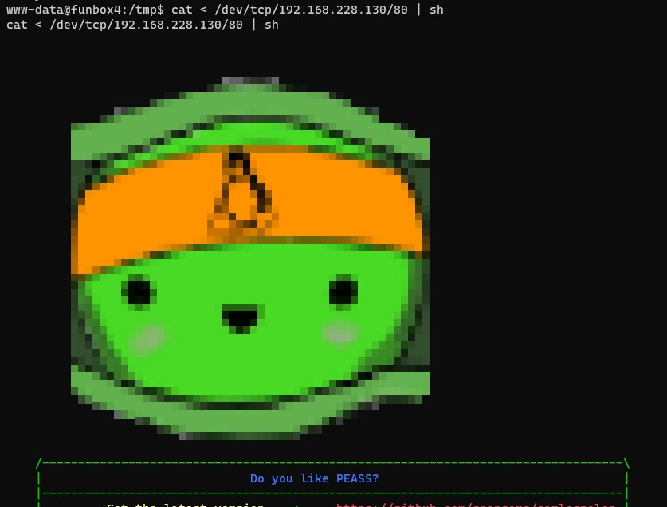
</p>

Il nous retourne pas mal d'informations, mais rien de bien intéressant (ou alors je n'ai pas su les exploiter).

Mais on sait que l'OS est vieux et linpeas nous propose des exploits pour notre OS avec des statistiques de réussite.

<p align="center">
  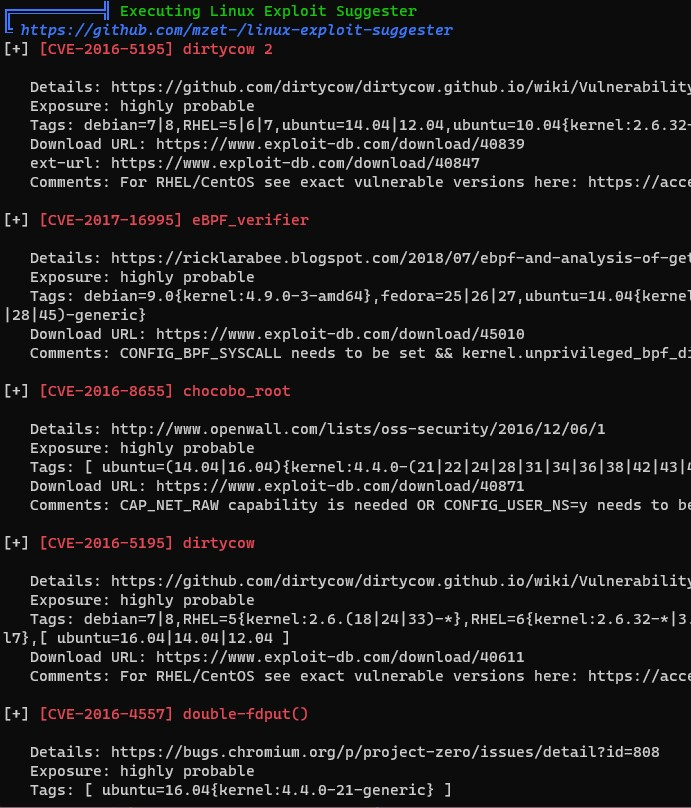
</p>

Mais avant de me lancer dans l'exploitation de des exploits , je vais me concentrer sur cette histoire de `rockyou.txt`, de `sed` et de `! à ajouter au mot de passe`.<br>
Peut-être qu'on peut escalader les privilèges avec `thomas`.

Donc on va juste faire une copie du fichier `rockyou.txt` et on va ajouter un `!` à la fin de chaque mot avec la commande `sed`.

```bash
sed 's/$/!/' rockyou.txt > rockyou2.txt
```

On va ensuite utiliser `hydra` pour faire un bruteforce sur le service SSH avec le fichier `rockyou2.txt` et l'utilisateur `thomas`.

<p align="center">
  
</p>

On a donc trouvé le mot de passe de l'utilisateur `thomas`, qui est `thebest!`.

On va donc se connecter en SSH avec cet utilisateur.

<p align="center">
  
</p>

On va voir les droits sudo de l'utilisateur avec la commande `sudo -l`.

<p align="center">
  
</p>

Dommage, Thomas n'a pas de droit sudo. On va donc devoir rester sur notre idée de base de faire un exploit sur l'OS.

En reregardant les exploits proposés par `linpeas`, on voit qu'il y a un exploit pour `dirtycow`. Grâce aux liens donnés, on va retrouver le code de l'exploit. On aura juste à le copier-coller dans un fichier et à le compiler.

<p align="center">
  
</p>

Pour compiler, il nous faut gcc. Donc au cas où, on va regarder et prier que gcc soit installé sur la machine.

<p align="center">
  
</p>

C'est assez intéressant, car en mettant en commun avec mes amis, on a vu que pour certains, ils ne pouvaient avoir accès à gcc (en réinstallant la machine après, j'ai remarqué que je n'avais plus gcc non plus).

Mais pour l'instant on a gcc, on va donc s'en servir pour compiler l'exploit.

<p align="center">
  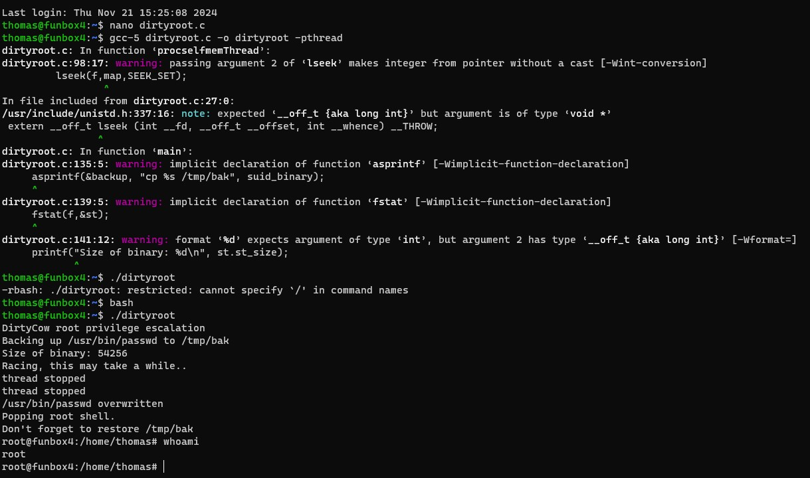
</p>

Et voilà, on a un accès root sur la machine... Du moins pendant 30 secondes, car la machine kernel panic ensuite.

<p align="center">
  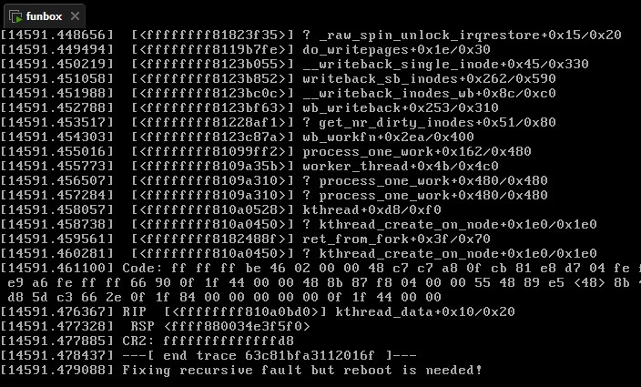
</p>

Je reboot la machine et retente l'exploit, et rebelote. Cependant, après 5 essais, j'ai eu le temps de chercher un peu plus sur la machine et j'ai trouvé un fichier `flag.txt` dans le répertoire `/root`.

<p align="center">
  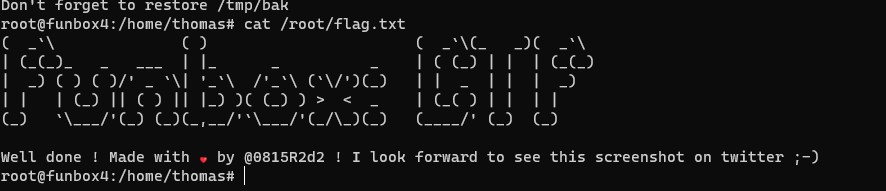
</p>

Après avoir mis en commun avec mes amis, je leur ai expliqué comment j'ai fait fonctionner dirtycow et ils ont pu le reproduire, mais eux pas de kernel panic, ils ont pu garder l'accès root... étrange.

Apparemment ce n'est pas grave, j'ai quand même réussi.
<p align="center">
  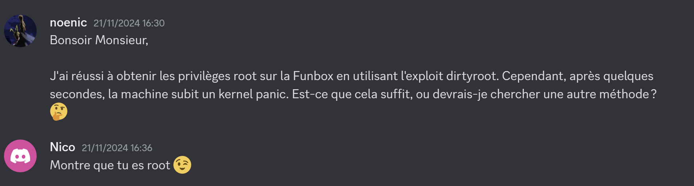
</p>

Je suis root (30 secondes), donc je suis content.

---

### 2.2 SSH

Cette partie a été faite pendant que je cherchais des informations sur le service HTTP. 

Connaissant la version du service SSH, j'ai cherché des exploits et j'ai vu qu'il y avait une vulnérabilité sur l'énumération des utilisateurs. 

J'ai donc utilisé un exploit de metasploit.

<p align="center">
  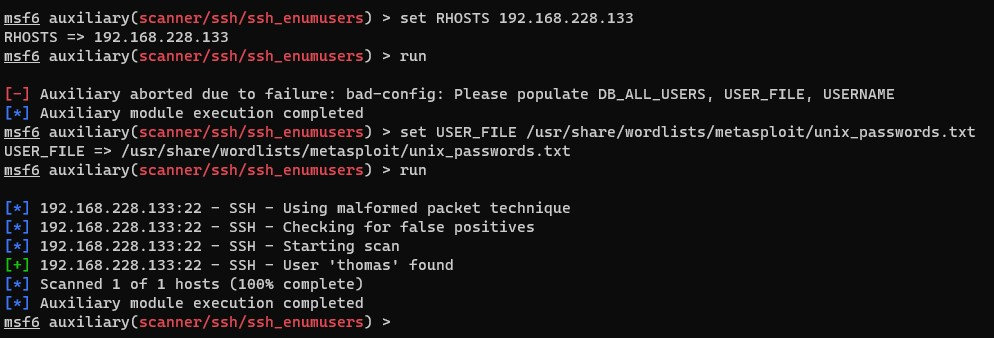
</p>

Alors c'est très drôle, parce que j'avais fait un mauvais copier-coller, ce qui fait que j'ai utilisé le fichier `unix_passwords.txt` comme wordlist pour le bruteforce des utilisateurs, et c'est comme ça que j'ai trouvé l'utilisateur `thomas` sans aucun faux positif.

En mettant en commun avec un ami, on a remarqué qu'on avait des résultats différents, et c'était probablement dû au fait que ma VM cible était sous VMWare avec une machine d'attaque WSL, alors que lui avait ses deux machines sur VirtualBox. Mes machines étaient donc plus rapides, et étant donné que l'exploit SSH se base sur le temps de réponse, j'ai eu plus de chance de trouver l'utilisateur. Ce qui nous a aussi mis sur la piste, c'est que plus tard, j'ai trouvé le mot de passe en 5 minutes, alors que lui a mis 15 minutes pendant le bruteforce du mot de passe.

Mais bon, à ce moment-là, je ne connaissais que l'utilisateur `thomas`.

J'ai donc essayé de bruteforcer le mot de passe de l'utilisateur `thomas` avec `hydra` et la wordlist `rockyou.txt`. (Évidemment, je n'avais pas encore connaissance du fichier `hint.txt`)

<p align="center">
  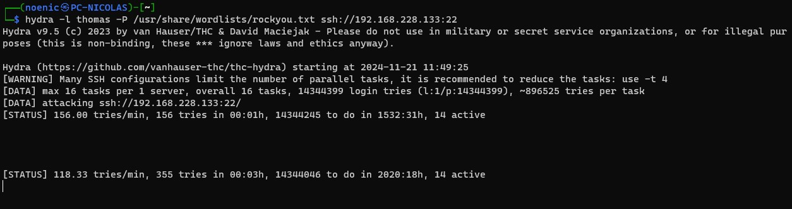
</p>

Sans succès. Après 20 minutes, j'ai abandonné et je suis retourné sur le service HTTP.

---

## Conclusion

Cette machine était très intéressante, car c'est la première fois qu'on fait un exploit sur l'OS directement. Généralement, on exploite des services ou des configurations mal sécurisées, mais là, on a exploité une faille dans le système d'exploitation lui-même. Rien que pour ça, cette machine est ma préférée.

On peut quand même lui reprocher que la partie HTTP était un peu ennuyante. On se retrouve encore dans un espèce de jeu de piste pour trouver des répertoires cachés, pour au final uploader un fichier php.

